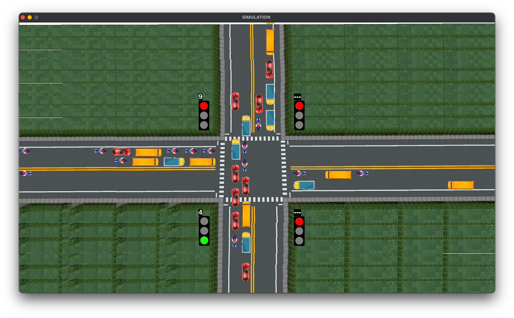

# Simulador de Tráfico con Modelo Macroscópico

## Introducción

En este proyecto, desarrollé un simulador de tráfico utilizando un modelo macroscópico. El objetivo principal fue analizar el comportamiento del tráfico en una determinada área y evaluar diferentes estrategias de gestión del tráfico.

## Modelo Macroscópico

El modelo macroscópico utilizado se basa en la teoría del flujo de tráfico y considera variables como la densidad de vehículos, la velocidad promedio y el flujo de tráfico. Se implementó utilizando [lenguaje de programación] y [bibliotecas/frameworks utilizados].

## Estructura del Proyecto

El proyecto se divide en las siguientes clases principales:

# 1. Vehicle:
    Es una implementación de un objeto de vehículo que se utiliza en una simulación de tráfico. Esta clase hereda de `pygame.sprite.Sprite`, lo que le permite ser manejada por el sistema de sprites de Pygame para su renderizado y actualización. La clase Vehicle se inicializa con varios parámetros que definen su estado inicial, incluyendo el carril en el que se encuentra `(lane)`, la clase del vehículo `(vehicleClass)`, la dirección en la que se moverá `(direction)`, y si el vehículo realizará un giro `(will_turn)`.

    La clase Vehicle tiene métodos para manejar su movimiento en diferentes direcciones (`Move_right`, `Move_down`, `Move_left`, `Move_up`), que incluyen lógica para cruzar líneas de parada, girar y mantener espacios entre vehículos. Además, tiene un método render para dibujar el vehículo en la pantalla, y un método move que selecciona la dirección de movimiento basada en un diccionario y llama al método correspondiente.

# 2. TrafficSignal: 
    Es una representación de una señal de tráfico, que es un componente crucial en el control del flujo de tráfico en las intersecciones de las carreteras. Esta clase se utiliza para modelar las señales de tráfico en una simulación o aplicación relacionada con el tráfico, permitiendo simular el comportamiento de las señales de tráfico en diferentes estados (rojo, amarillo, verde).

    La clase TrafficSignal tiene un constructor que toma tres argumentos enteros: red, yellow, y green. Estos argumentos representan las duraciones en segundos de cada fase de la señal de tráfico:

- `red`: La duración de la luz roja, que indica que el tráfico debe detenerse.
- `yellow`: La duración de la luz amarilla, que indica que los vehículos deben prepararse para detenerse.
- `green`: La duración de la luz verde, que indica que el tráfico puede avanzar.

    Además, la clase tiene un atributo signalText que es una cadena vacía por defecto. Este atributo podría ser utilizado para almacenar o mostrar texto adicional relacionado con la señal de tráfico, como instrucciones específicas para los conductores o información sobre el estado de la señal.

# 3. Traffic_generate: 
    Función que simula la generación de tráfico en una intersección durante la hora pico.

    La generación de tráfico se realiza en un bucle while que se ejecuta mientras la variable global peakHour sea verdadera.

    Dentro del bucle, se seleccionan aleatoriamente varios atributos para cada vehículo:

- Tipo de vehículo `(vehicle_type)`: Se elige un tipo de vehículo de una lista de tipos permitidos (allowedVehicleTypesList) utilizando random.choice().
- Carril `(lane_number)`: Se selecciona un carril aleatorio entre 1 y 2 utilizando random.randint().
- Giro `(will_turn)`: Se decide si el vehículo realizará un giro basado en un número aleatorio y si el carril seleccionado permite giros.
- Dirección `(direction_number)`: Se selecciona una dirección aleatoria basada en un número aleatorio y una lista de distancias (dist). La dirección se determina comparando el número aleatorio con los valores en dist y seleccionando la dirección correspondiente.

    Después de seleccionar estos atributos, se instancia un nuevo objeto Vehicle con los atributos seleccionados. La función también incluye una pausa de 0.1 segundos (time.sleep(0.1)) entre cada generación de vehículo para simular el paso del tiempo.
 ## Resultados

A continuación se presentan algunos de los resultados obtenidos durante la simulación:

*Figura 1: Gráfico de densidad de tráfico en función del tiempo*

*Figura 2: Mapa de flujo de tráfico en la zona de estudio*

## Conclusiones

En base a los resultados obtenidos, se pueden extraer las siguientes conclusiones:

1. [Conclusion 1]
2. [Conclusion 2]
3. [Conclusion 3]

## Próximos Pasos

En futuras iteraciones del proyecto, se podrían considerar las siguientes mejoras:

1. [Mejora 1]
2. [Mejora 2]
3. [Mejora 3]

## Referencias

- [Referencia 1]
- [Referencia 2]
- [Referencia 3]